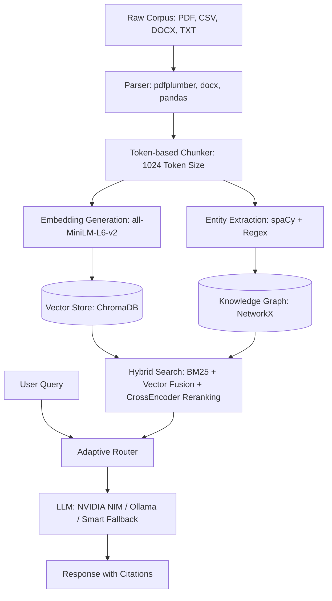

# Synapse — Graph-Augmented RAG Intelligence Engine

A **hybrid retrieval, knowledge-graph-augmented RAG** system with adaptive model routing. Ingests heterogeneous documents and answers questions with cited, confidence-scored responses by merging semantic vector search with a structured knowledge graph.

---

## Architecture



---

## Repository Structure

```
├── data/                       # Ingested and generated data
│   ├── corpus/                 # Source document corpus
│   │   ├── real/               # Place your documents here
│   │   ├── synthetic/          # Generated logs (CSV)
│   │   └── uploads/            # Persistent user-uploaded files
│   ├── benchmarks/             # Ground-truth Q&A pairs for evaluation
│   ├── chroma_db/              # ChromaDB vector store (auto-generated)
│   └── documents.json          # Metadata registry (auto-generated)
│
├── src/                        # System source code
│   ├── main.py                 # FastAPI application and endpoints
│   ├── config.py               # Pydantic configuration & environment variables
│   ├── App.py                  # Streamlit frontend application
│   ├── pipeline/               # Ingestion pipeline modules
│   │   ├── parser.py           # TXT, PDF, DOCX, and CSV parsers
│   │   ├── chunker.py          # Paragraph/Sentence boundary chunker
│   │   ├── embedder.py         # Local SentenceTransformer vector embedding
│   │   ├── extractor.py        # spaCy + Regex entity extraction
│   │   ├── compliance.py       # Regulatory gap analysis
│   │   ├── ingest.py           # Ingestion pipeline coordinator
│   │   └── query_engine.py     # Context retrieval + answer generation
│   ├── storage/
│   │   └── chroma_store.py     # ChromaDB vector collection manager
│   ├── graph/
│   │   └── knowledge_graph.py  # NetworkX knowledge graph
│   └── database/
│       ├── connection.py       # SQLAlchemy session management
│       └── models.py           # Database models
│
├── web/                        # Next.js frontend (Vercel)
│   └── src/app/                # App Router pages
│
├── tests/                      # Test suites
├── requirements.txt            # Python dependencies
├── Dockerfile                  # Container build
├── start.sh                    # Launch backend + frontend
└── stop.sh                     # Stop servers
```

---

## Quick Start

### Prerequisites

- **Python 3.10+**
- **Node.js 18+** (for the Next.js frontend)
- **Optional:** NVIDIA NIM API key ([sign up free](https://build.nvidia.com/))
- **Optional:** [Ollama](https://ollama.com/) for fully offline LLM

### 1. Install Dependencies

```bash
git clone <your-repo-url>
cd synapse
python3 -m venv .venv
source .venv/bin/activate
pip install -r requirements.txt
python -m spacy download en_core_web_sm
```

### 2. Configure Environment

```bash
cp .env.example .env
# Edit .env — add NVIDIA_API_KEY_1 or install Ollama for LLM answers
# Without either, Synapse uses "Smart Context" fallback (formats raw chunks)
```

### 3. Launch

```bash
./start.sh
```

- **Backend:** http://localhost:8000
- **Frontend:** http://localhost:3000

### 4. Initialize the Corpus

Click **"Scan & Index Default Corpus"** in the UI, or:

```bash
curl -X POST http://localhost:8000/ingest/initialize
```

### 5. Query

```bash
curl -X POST http://localhost:8000/query \
  -H "Content-Type: application/json" \
  -d '{"question": "What are the safety requirements for PUMP-A01?"}'
```

---

## API Reference

All endpoints documented at http://localhost:8000/docs (Swagger UI).

| Endpoint | Method | Description |
|---|---|---|
| `/health` | GET | Health check |
| `/llm/status` | GET | LLM availability |
| `/query` | POST | Non-streaming RAG query |
| `/query/stream` | POST | SSE streaming RAG query |
| `/ingest/initialize` | POST | Clear and re-ingest corpus (Admin) |
| `/ingest/upload` | POST | Upload and ingest files (Admin) |
| `/documents` | GET | List ingested documents |
| `/graph` | GET | Knowledge graph JSON |
| `/graph/top` | GET | Top N most-connected nodes |
| `/graph/path` | GET | Shortest path between entities |
| `/entities` | GET | All entities grouped by type |
| `/compliance/check` | POST | Regulatory gap analysis |
| `/debug/search` | GET | Raw vector search (Admin) |
| `/benchmark/run` | GET | Run accuracy benchmark (Admin) |
| `/feedback` | POST | Log thumbs up/down feedback |

---

## Configuration

All settings in `src/config.py`, loaded from `.env`:

| Setting | Default | Description |
|---|---|---|
| `ADMIN_API_KEY` | `""` | API key for protected endpoints |
| `REQUIRE_ADMIN_KEY` | `false` | Abort startup without admin key |
| `CORS_ORIGINS` | `""` (allow all) | Comma-separated allowed origins |
| `NVIDIA_API_KEY_1`..`10` | `""` | NVIDIA NIM API keys (tried in order) |
| `HF_TOKEN` | `""` | Hugging Face token for embedding API |
| `chunk_size` | `1024` | Tokens per chunk |
| `chunk_overlap` | `200` | Overlap between chunks |
| `top_k` | `50` | Default chunks retrieved |
| `use_reranker` | `true` | Cross-encoder re-ranking |
| `use_hybrid` | `true` | BM25 + vector fusion |
| `use_graph` | `true` | Knowledge graph traversal |
| `use_semantic_cache` | `true` | Semantic similarity cache |

---

## Docker

```bash
docker build -t synapse .
docker run -p 8000:8000 -e NVIDIA_API_KEY_1=nvapi-xxx synapse
```

## Vercel (Frontend)

1. Push to GitHub
2. Import in Vercel — framework: Next.js, root: `web/`
3. Set `NEXT_PUBLIC_API_URL=https://your-backend.onrender.com`
4. Deploy

---

## LLM Routing

Synapse uses an adaptive router that selects the right model based on query complexity:

| Mode | Model | Use Case | Latency |
|---|---|---|---|
| **Fast** | Llama 3.1 8B | Simple lookups, record queries | ~500ms |
| **Deep** | Nemotron 550B | Complex synthesis, comparisons | ~2-5s |
| **Auto** | Classifier decides | Default — best of both | Varies |
| **Fallback** | Smart Context | No LLM available | ~100ms |

---

## License

MIT
