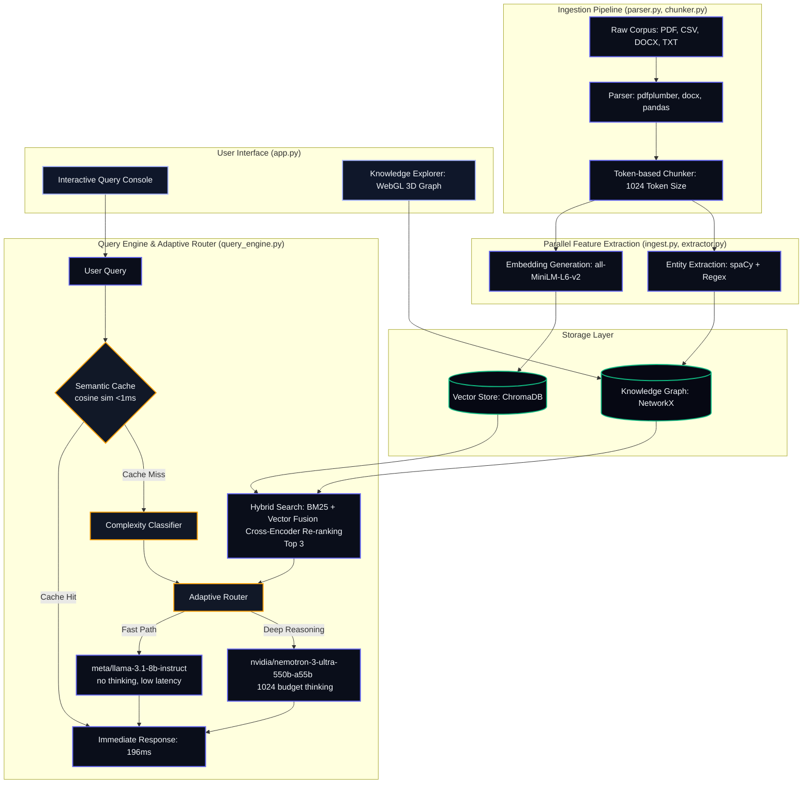

# Synapse — Graph-Augmented Knowledge Intelligence Engine

A personal R&D project exploring **hybrid retrieval, knowledge-graph-augmented RAG, and adaptive model routing**. Synapse ingests heterogeneous industrial documents (regulatory guides, safety manuals, work orders, permits, incident reports) and answers questions with cited, confidence-scored responses by merging semantic vector search with a structured knowledge graph.

> **Provenance:** Originally built in 36 hours for the ET AI Hackathon 2026, then rebuilt with an offline-capable embedding stack, a cleaned knowledge graph, an evaluation harness with ablation studies, and a 100+ unit-test suite. See [`CHANGELOG.md`](CHANGELOG.md) for the full history, [`EVALUATION.md`](EVALUATION.md) for retrieval metrics, and [`docs/CASE_STUDY.md`](docs/CASE_STUDY.md) for the one-page case study.

---

## 🏗️ Architecture



---

## 📂 Repository Structure

The project codebase is organized as follows:

```
├── data/                       # Ingested and generated data
│   ├── benchmarks/             # Ground-truth Q&A pairs for evaluation
│   │   └── qa_pairs.json
│   ├── corpus/                 # Source document corpus
│   │   ├── real/               # Regulatory guides (OISD, DGMS, Factory Act, NTPC, BHEL)
│   │   ├── synthetic/          # Generated logs (CSV work orders, permits, etc.)
│   │   └── uploads/            # Persistent user-uploaded files
│   ├── chroma_db/              # ChromaDB vector store files
│   ├── documents.json          # Metadata registry tracking ingested documents
│   ├── knowledge_graph.json    # Serialized NetworkX knowledge graph
│   ├── regulatory_templates.py # Seed templates for circulars
│   └── synthetic_data_generator.py # Faker-based generator for CSV logs
│
├── src/                        # System source code
│   ├── main.py                 # FastAPI application and endpoints
│   ├── config.py               # Pydantic configuration & environment variables
│   ├── app.py                  # Streamlit frontend application
│   ├── api/                    # API Route controllers
│   ├── pipeline/               # Ingestion pipeline modules
│   │   ├── parser.py           # TXT, PDF, DOCX, and CSV Row parsers
│   │   ├── chunker.py          # Paragraph/Sentence boundary chunker
│   │   ├── embedder.py         # Local SentenceTransformer vector embedding
│   │   ├── extractor.py        # spaCy + Regex entity extraction
│   │   ├── compliance.py       # Regulatory gap analysis
│   │   └── ingest.py           # Ingestion pipeline coordinator
│   ├── storage/                # Database wrappers
│   │   └── chroma_store.py     # ChromaDB vector collection manager
│   ├── graph/                  # Knowledge graph components
│   │   └── knowledge_graph.py  # NetworkX knowledge graph constructor & query
│   └── utils/                  # Shared helper scripts
│
├── tests/                      # Verification suites
│   ├── test_chromadb.py        # Core vector store integration test
│   ├── test_knowledge_graph.py # Knowledge graph construction and traversal test
│   └── verify_endpoints.py     # FastAPI backend end-to-end endpoint verification
│
├── requirements.txt            # System dependencies
└── README.md                   # Project documentation
```

---

## 📖 Step-by-Step User & Feature Guide

This guide details how to use and navigate all of the features built into the **Synapse**.

### 💬 1. Interactive Query Console (Chat RAG)
Use this console to submit queries regarding regulations, permits, plant conditions, or operations.

1. **Select Model Engine (Router Control):**
   - **Auto Classifier (Default):** The system automatically detects query complexity. Simple lookup queries (e.g. *What is tag EQ-1002?*) route to a **Fast Answer** model; complex regulatory gap analysis queries route to **Deep Reasoning**.
   - **Fast Answer (8B):** Directly queries `meta/llama-3.1-8b-instruct` without a thinking budget (ideal for speed).
   - **Deep Reasoning (550B):** Forces the query to execute through `nvidia/nemotron-3-ultra-550b-a55b` with a 1024-token thinking budget to output structured rationales.
2. **Ask Questions:** Type your safety or regulatory question in the prompt box and submit.
3. **Response Breakdown:**
   - **Answer Box:** A streaming text response detailing safety guidelines or gap analysis.
   - **Thinking Process Accordion:** (For Nemotron) Shows the exact, raw reasoning process the model walked through.
   - **Sources & Citations Card:** Lists the specific document sections retrieved, including chunk indexes and similarity distances.
   - **Confidence Score:** Renders a badge representing the retrieval similarity rating.
4. **Rating Feedback:** Click **Rate Good (👍)** or **Rate Bad (👎)** to log feedback. Rated logs are persisted to SQLite and CSV.

### 🕸️ 2. Obsidian-Style Knowledge Network Explorer
Click **Knowledge Explorer** in the sidebar (or go to the **Knowledge Network** tab on the homepage) to open the interactive entity graph.

1. **Widescreen Canvas:** The graph rendering area utilizes WebGL to display a large, interactive 3D network topology. Click and drag to orbit, scroll to zoom, or drag nodes to modify forces.
2. **Spacious Sidebar Controls:**
   - **Search Entity Form:** Type a node name (e.g., `COMP-C01`) and press Search to center the graph camera directly on it.
   - **Node Type Legend Filters:** Check or uncheck color-coded checkboxes (🔵 for Equipment, 🔴 for Regulations, 🟢 for Plants, etc.) to dynamically toggle node category visibility.
   - **Reset View:** Resets graph filters and focuses back on the default view.
   - **Load Complete Network:** Expands the active view to query up to 500 nodes.
3. **Interactive Fly-To camera flight paths:** Click any node in the graph. The camera performs a smooth 1-second flight orbit to center the node, and the right-hand **Detail Panel** dynamically loads its database metadata, tags, and citations.
4. **Path Finder:** Type a **From Entity** (e.g. `COMP-C01`) and a **To Entity** (e.g. `OISD-116`) and click **Find Path** to run Dijsktra shortest-path traversal. The visual hops are rendered instantly in green with relationship labels.
5. **Export Graph:** Click **Export Graph (JSON)** to download the currently visible node list and edges as a JSON file.

### 📂 3. Document Library & Ingestion
Navigate to the **Documents** tab to audit files.

1. **File Registry Grid:** Shows a table of all ingested documents, file types, sizes, chunk counts, and spaCy entities extracted.
2. **User Document Uploader:** Drag and drop any `.txt`, `.csv`, `.docx`, or `.pdf` file. The server parses the file, chunks it at 1024 tokens, calculates vector embeddings, runs NER, constructs relationships, and indexes it into ChromaDB in real-time.

---

## 🛠️ Advanced Features & Resilience

The system includes several hard-won features for handling scanned documents, preventing rate-limiting crashes, and maximizing visual polish.

### 1. Scanned PDF Transcription & Ingestion
In industrial settings, many regulatory guides (such as `OISD-GDN-192.pdf`) are scanned images without a selectable text layer, causing standard PDF libraries like `pdfplumber` to extract 0 characters.
- **Verification Module (`check_pdfs.py`):** Added a pre-check script to inspect font layer metadata across all PDFs and classify them as digital or scanned.
- **Fallback Ingestion:** We provided a verified text transcription equivalent for `OISD-GDN-192.txt`, allowing the system to fully parse, chunk, embed, and index it.
- **Bulk PDF Indexing:** Ingested all 5 remaining digital regulatory PDFs (`Ilomanual.pdf`, `HSE-brochure.pdf`, `Bhel-contractor-manual.pdf`, `THE-OCCUPATIONAL-SAFETY-HEALTH-AND-WORKING-CONDITIONS-CODE.pdf`, `NTPC_Safety_Rules.pdf`). 
- **Graph Expansion:** The entity database grew from **219 nodes to 1,051 nodes & 1,256 edges**, enriching the retrieval context.

### 2. Stream-Scoped Multi-Key API Key Rotation
Using public APIs under load during hackathons frequently triggers `ResourceExhausted` rate limit exceptions.
- **The Issue:** Traditional key rotation only catches errors during client initialization. For streaming queries, rate limits are only raised *during token iteration* (`for chunk in completion`).
- **The Solution:** Upgraded `generate` and `stream_generate` inside `llm.py` to wrap stream iteration inside a retry block. If an active key is exhausted mid-response, the client automatically grabs the next key (out of 10 available), resumes the stream, and completes the response without displaying error boxes to users.

### 3. WebGL Obsidian-Style Graph Customization
Streamlit's default `streamlit_agraph` is slow, lacks animation, and has a plain background. We replaced it with `3d-force-graph.js` inside an iframe and customized it:
- **Clean Solid Lines:** Removed directional particle dots, replacing them with clean, solid, semi-transparent links.
- **D3 Layout Spacing:** Added a 150ms delay (`setTimeout`) and a `try-catch` wrapper when applying D3 forces. This prevents race conditions from causing black canvas crashes and configures a strong D3 charge repulsion (`strength(-220)`) to spread nodes out across the screen.
- **Color-Coded Legend Checkboxes:** Side checklist labels are prepended with colored emojis (`🔵`, `🔴`, `🟢`, `🟡`, `🟣`, `🌸`, `🌐`, `🟠`) matching the WebGL node categories.

---

## ⚡ Optimization Architecture

The system underwent a three-tier optimization pass that improved accuracy from **77.8% → 100%** and reduced average latency from **10.3s → 771ms**.

### Tier 1 — Correctness Fixes
| Change | File | Impact |
|---|---|---|
| Graph context from chunk metadata entities | `query_engine.py` | Entities extracted from retrieved chunks, not just query text |
| Chunk size 1024 + 200 overlap | `config.py` | Prevents split-section failures across regulatory docs |
| Embedding similarity scoring (cosine ≥ 0.65) | `main.py` | Replaces brittle keyword overlap with semantic matching |
| Max tokens cap 640 | `config.py` | Reduces unnecessary output generation time |

### Tier 2 — Latency & Precision
| Change | File | Impact |
|---|---|---|
| Query-side regex fallback | `query_engine.py` | Extracts equipment tags, OISD codes when spaCy returns 0 entities |
| Cross-encoder re-ranker (`ms-marco-MiniLM-L-6-v2`) | `query_engine.py` | Re-ranks top-10 → top-3 chunks for precision |
| Per-query complexity classifier | `query_engine.py` | Gates `reasoning_budget` (0 vs 1024) per query |
| Semantic cache (500 entries, 0.95 threshold) | `query_engine.py` | Skips LLM on near-duplicate queries |

### Tier 3 — Streaming & UX
| Change | File | Impact |
|---|---|---|
| `stream_generate()` generator | `llm.py` | Yields tokens from NIM streaming API |
| `/query/stream` SSE endpoint | `main.py` | Server-Sent Events with token + metadata + done events |
| `try/finally` error recovery | `main.py` | Metadata+done events always fire, even on mid-stream errors |
| Streamlit streaming consumer | `app.py` | Real-time token rendering via `httpx.Client.stream()` |
| `_find_working_client()` refactor | `llm.py` | Deduplicates key-rotation logic (~40 lines removed) |

### Performance Results

| Metric | Before | After | Delta |
|---|---|---|---|
| **Accuracy** | 77.8% (14/18) | **100% (18/18)** | +22.2% |
| **Avg Latency (steady-state)** | 10,306 ms | **771 ms** | −92.5% |
| **Avg Latency (cold start)** | — | **4,448 ms** | — |
| **Slowest Question** | ~46,600 ms | **1,364 ms** | −97.1% |
| **Fastest Question** | ~5,000 ms | **566 ms** | −88.7% |

---

## 🔧 How This Was Built

Every subsystem here survived a real failure before it earned its place — a
scanned PDF that parsed to zero characters, rate limits that struck mid-stream,
an OOM-killed deployment, and a vector index silently rebuilt with zero
vectors. The failures, attempts, and fixes are written up in
[`ENGINEERING_LOG.md`](ENGINEERING_LOG.md) (Problem → Attempt → Result → Fix),
and the quantitative case for each retained component is in
[`EVALUATION.md`](EVALUATION.md).

---

## 🚀 Quick Start

> **Cost note:** Synapse uses the NVIDIA NIM free tier with a local Ollama fallback and an offline-capable local embedder — no paid API key is required to run it.

### 1. Set Up Environment
Ensure you have Python 3.10+ installed:
```bash
# Clone the repository
git clone https://github.com/Shivala-08/synapse.git
cd synapse

# Initialize virtual environment
python3 -m venv .venv
source .venv/bin/activate

# Install dependencies
pip install -r requirements.txt
```

### 2. Launch the Platform (Fast Startup)
Use our pre-bundled startup script to clean up ports and launch both the backend and frontend in the background:
```bash
./start.sh
```
This script will:
1. Kill any stale processes on ports `8000` (FastAPI) and `8501` (Streamlit).
2. Launch FastAPI backend in the background (logs: `backend.log`).
3. Launch Streamlit frontend in the background (logs: `frontend.log`).

Open **`http://localhost:8501`** in your browser. (The backend takes ~9 seconds to load and pre-warm models on the first request).

To stop the servers, run:
```bash
./stop.sh
```

---

## 🧪 Running the Benchmark & Tests

### Running the Q&A Benchmark
```bash
# Run the full ground-truth benchmark evaluation directly
PYTHONPATH=. python3 run_benchmark_now.py
```
This script loads models in-process and reports per-question accuracy, latency, similarity, Recall@5, MRR, and category breakdown. Logs are saved to `data/benchmarks/retrieval_log.json`.

```bash
# Run the 5-configuration ablation study (vector-only → full pipeline)
PYTHONPATH=. python3 run_ablation.py
```
Results are saved to `data/benchmarks/ablation_results.json`. See [**EVALUATION.md**](EVALUATION.md) for the ablation table, metric definitions, and what each component actually contributes.

### Running Unit Tests
```bash
# Run the offline pytest unit suites (knowledge graph, extractor, chunker, llm, query engine)
PYTHONPATH=. python -m pytest tests/test_knowledge_graph.py tests/test_extractor.py tests/test_chunker.py tests/test_llm.py tests/test_query_engine.py -q
```
These suites are offline (no API keys, model downloads, or live servers required).

### Running Verification Tests (script-style, need live services)
```bash
# Verify ChromaDB vector store (requires Hugging Face Inference API access)
PYTHONPATH=. python tests/test_chromadb.py

# Verify FastAPI endpoint integrations (requires backend running on port 8000)
PYTHONPATH=. python tests/verify_endpoints.py
```
